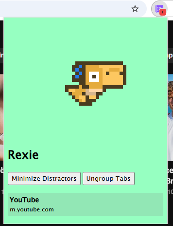

# what i wanna make (6/4/2026)
i want to create something that helps teenagers get the motivation to do their work and have something to check up on their mental health because they matter. anyone should be able to use the extension with ease and i want to continue working on this project for a while because i think it's a great learning experience as extensions are sort of like web development

# what is rexie?
rexie is a google chrome extension that when you click on you have the ability to group distractions and it'll minimize them using tab groups, and the option to also ungroup them. the distractions included so far are youtube, instagram, and reddit but in the future i want to add a feature that allows you to add your own sites that you wanna stay off or track. when you open a new distraction it will track the timestamp and so this allows for things like if you want to see how long you've been spent doomscrolling or time you could have spent being a bit more productive which ill admit i have my bad days as well but yeah pretty much it

## helpful stuff
credits to [Chrome Extension Docs](https://developer.chrome.com/docs/extensions/get-started) because it has been really useful for learning how to start making an extension and [@ArksDigital](https://x.com/ArksDigital) for the [cute dinosaur used](https://arks.itch.io/dino-characters) SO cute!

